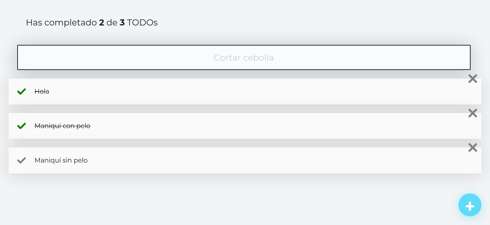

# Todo Machine

This small project was developed while I was learning the React Course on Platzi. It was created using React, JavaScript, and CSS.

## Table of contents

- [Overview](#overview)
  - [Funcionality](#funcionality)
  - [Screenshot](#screenshot)
  - [Links](#links)
- [My process](#my-process)
  - [Built with](#built-with)
  - [What I learned](#what-i-learned)
  - [Continued development](#continued-development)
- [Author](#author)

## Overview

### Funcionality

Users can:

    *Create new Todos.
    *Search for specific Todos using the Todo search bar.
    *Mark Todos as complete.
    *Delete Todos.

### Screenshot

### Links

- Live Site URL: [Add live site URL here][(https://insolisloyo.github.io/todo-machine-v1/)]

## My process

### Built with

- Semantic HTML5 markup
- CSS custom properties
- Flexbox
- React
- JS

### What I learned

During this course, I gained insights into developing a React application using best practices and learned new methods for structuring it effectively.

### Continued development

In the future, I aim to further refine my React skills.

## Author

- Platzi - [@platzi](https://platzi.com/cursos/react/)

